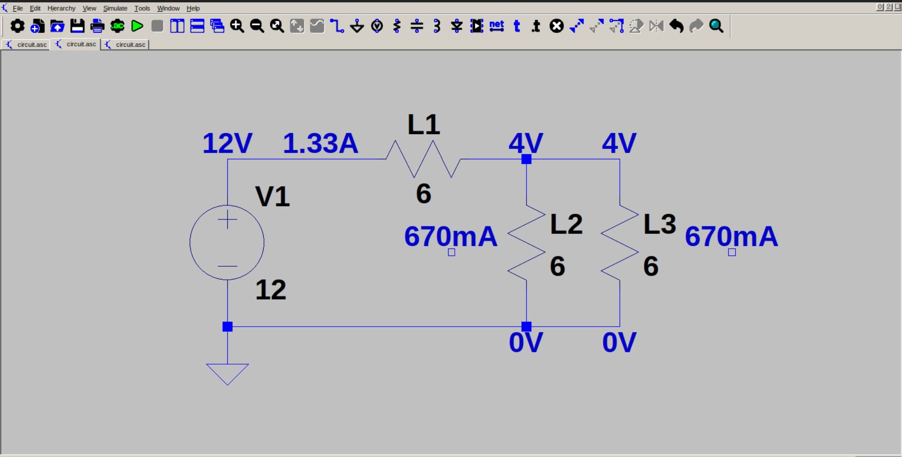

# Simple light bulb circuit (series + parallel)

This is a simple light bulb circuit* intended to demonstrate series + parallel connection in electrical circuits. Here, a bulb is connected in series to a parallel connection of 2 bulbs. Each bulb has a resistance of 6 ohm. The effective resistance of the circuit is 9 ohm, and current drawn from the circuit is 1.33 A. This is the current that passes through L1, and we can observe a voltage drop across L1 (8 V). The remaining 4 V is the voltage observed across L2 & L3 (same voltage due to parallel connection). The 1.33 A current splits by half, and each half passes through L1 & L2 (0.67 A).

In the end, L1 has 8 V across it, and L2 & L3 has 4 V across them. So L1 glows twice as bright as both L2 & L3.

*Since there is no light bulb symbol in LTSpice, I had to use a resistor.
