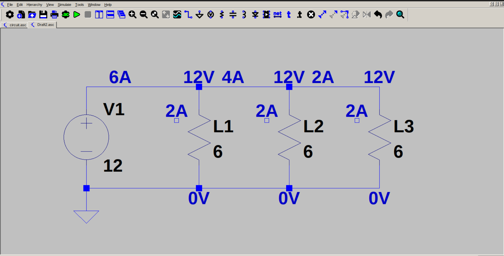

# Simple light bulb circuit (parallel)

This is a simple light bulb circuit* intended to demonstrate parallel connection in electrical circuits. Here, 3 bulbs of same resistance (6 ohm), is connected to a 12 V source, in parallel. Because of parallel connection, voltage across each bulb will be same as supply (12 V). The current through each bulb will be three times that of a series connection of the same circuit (in series, the current would be 666.666 mA. Here, the current through each bulb is 2 A (3 * 666.666mA)). As a result, each bulb will glow with same intensity. The effective resistance of the circuit is one-third the resistance of a single bulb.

*Since there is no light bulb symbol in LTSpice, I had to use a resistor.
