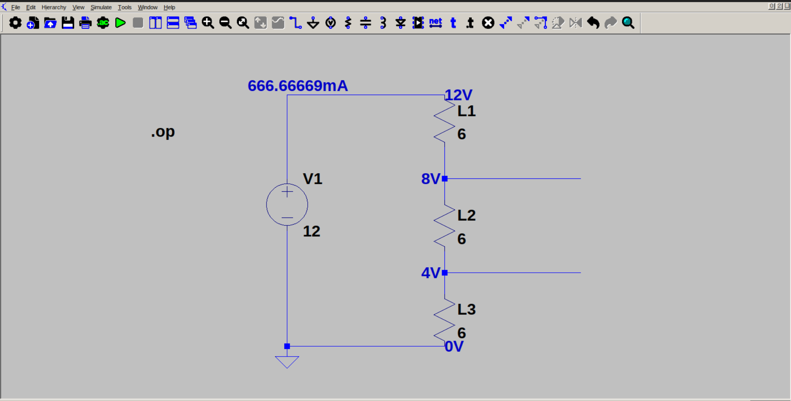

# Simple light bulb circuit (series)

This is a simple light bulb circuit* intended to demonstrate series connection in electrical circuits. Here, 3 bulbs of same resistance (6 ohm), is connected to a 12 V source, in series. Because of series connection, voltage drops across each bulb. The voltage across each bulb will be one-third of supply voltage (because the bulbs have same resistance). Current passing across all lamps will be same. As a result, each bulb will get dimmer with each voltage drop (L1>L2>L3). The effective resistance of the circuit is 3 times the resistance of a single bulb.

*Since there is no light bulb symbol in LTSpice, I had to use a resistor.
