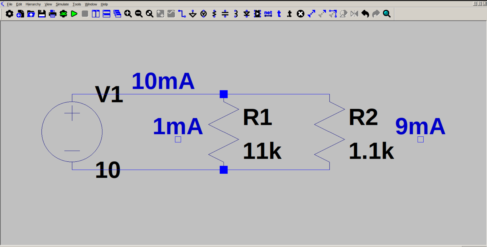

# Current divider circuit

*The current values are approximate

This circuit is intended to demonstrate the current dividing property in parallel circuits. A 10 V source is connected to 11k and 1.1k resistors, which are in parallel. A current of 10mA is drawn from source, and this current splits, and one part goes to R1 and other to R2. We can calculate the current through each resistor using Ohm's Law, or we can use Current Divider equations:

$$I_1 = I_{in}.R2/(R1+R2)$$

$$I_2 = I_{in}.R1/(R1+R2)$$
