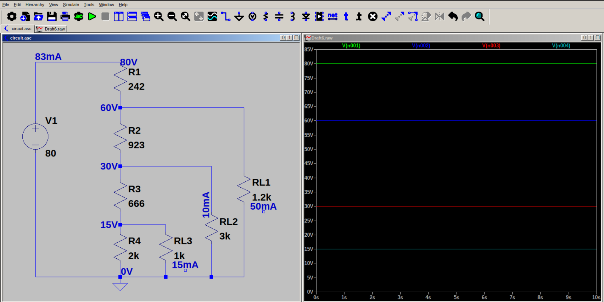

# Voltage Divider Circuit for loads with positive and negative requirements

We can use the voltage divider circuit to provide the required voltage to mutliple loads, by increasing the number of resistors. 

The requirement in this example is to provide required voltage for (60 V, 50 mA), (30 V, 10 mA) and (15 V, 15 mA) load devices using a 80 V supply.

Applying the 10 percent rule, bleeding current 

$$I_{R4} = 0.1 x (total load current)$$

$$I_{R4} = 5mA$$

Now applying KCL on each node, we can calculate $I_{R3}$, $I_{R2}$, and $I_{R1}$.

Using Ohm's Law, calculate R1, R2, R3 & R4.				
