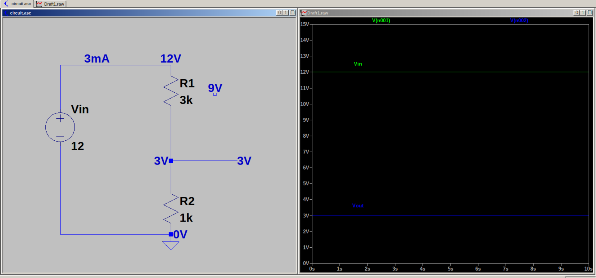

# Voltage Divider Circuit with no load

A voltage divider circuit is the most basic circuit using resistors. It is used to step down a higher input voltage to a lower output voltage. 
Input voltage is applied across R1 and R2 in series, but output voltage is taken across R2 only.

The equation for output voltage when no load is attached is given by,

$$Vout = Vin.R2/R1+R2$$

In this circuit, the goal is to step down input voltage of 12 V to output voltage of 3 V. For this, the ratio of resistors must be $R2/R1 = 1/3$. In this example we take $R1 = 3k$ and $R2 = 1k$. Hence, we get output voltage of 3 V across R2.
