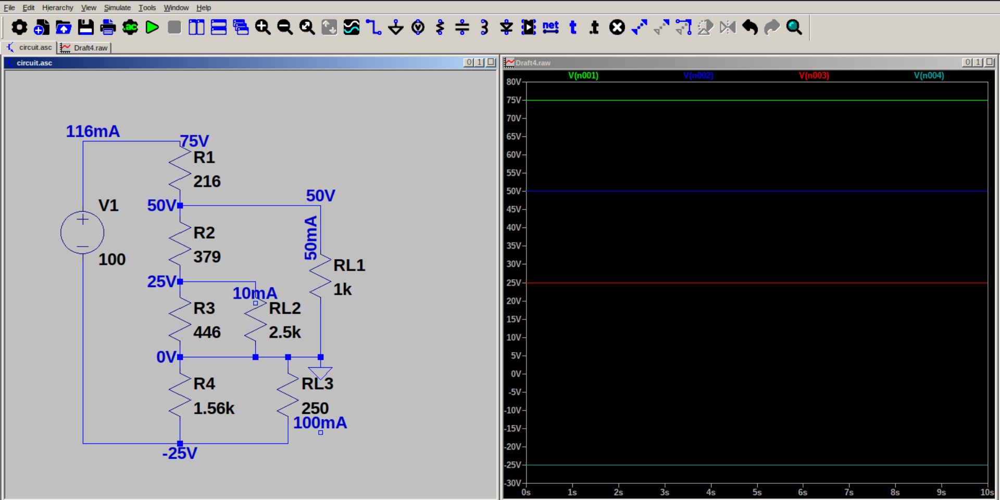

# Voltage Divider Circuit for loads with positive and negative requirements

Many load devices require positive and negative voltages for their operation. We can use a voltage divider to accomplish this task, by choosing another node as 0 V reference level (GND). 

The requirement in this example is to provide required voltage for (50 V, 50 mA), (25 V, 10 mA) and (-25 V, 100 mA) load devices using a 100 V supply.

Applying the 10 percent rule, bleeding current 
$$I_{R4} = 0.1 x total load current$$
$$I_{R4} = 16mA$$

Now applying KCL on each node, we can calculate $I_{R3}$, $I_{R2}$, and $I_{R1}$.
Using Ohm's Law, calculate R1, R2, R3 & R4.				
