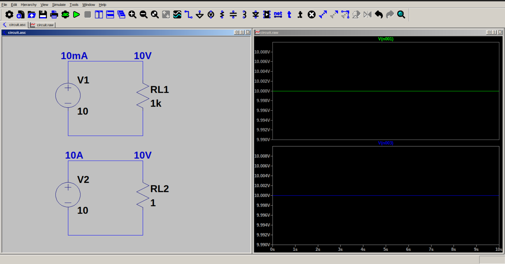

# Ideal voltage source

An ideal voltage source provides a constant voltage at its terminals, irrespective of load resistance. It does this by varying the current drawn from the source according to the load.
