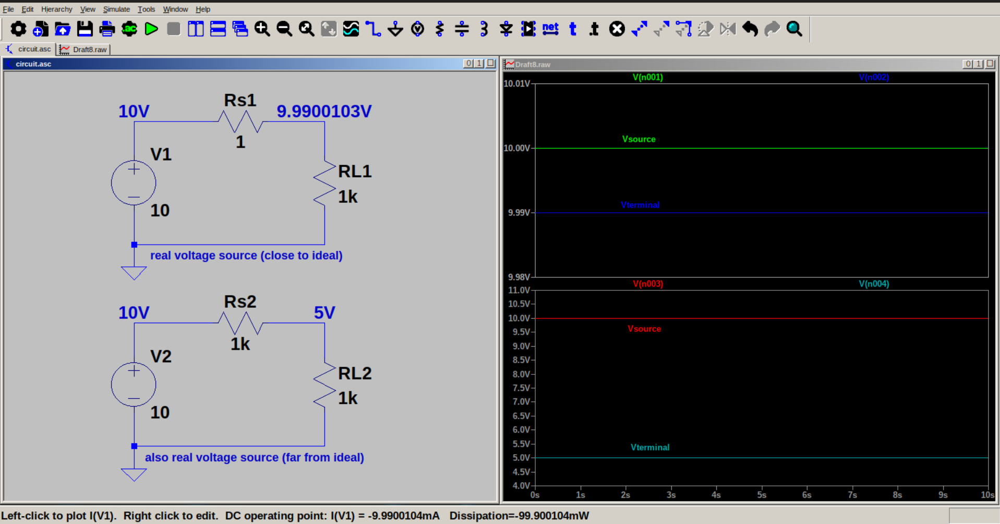

# Real voltage source

A real voltage source has some internal resistance inside it. A real voltage source can be represented as a voltage source in series with a resistor. 

If the internal resistance is small, and load resistance is very much greater than internal resistance, the real voltage source performs close to ideal voltage source. 
