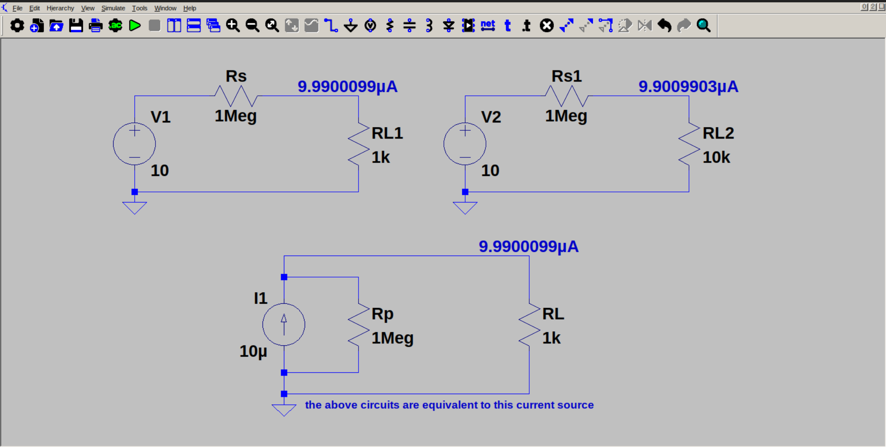

# Voltage source as current source

A real voltage source, but with a large internal resistance actually acts a current source, instead of a voltage source. So we can transform the circuit into a current source in parallel with the same internal resistance.
