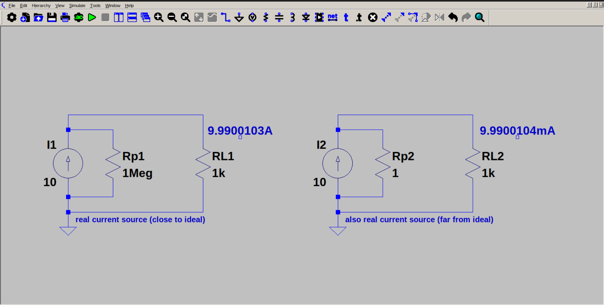

# Real current source

A real current source can be represented as a current source in parallel with a resistor. 

If the parallel resistance is large, and load resistance is very much smaller than parallel resistance, the real current source performs close to ideal current source. 
