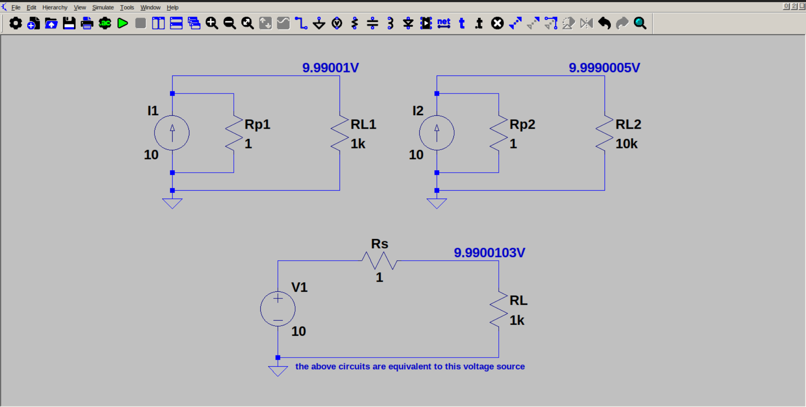

# Current source as voltage source

A real current source, but with small parallel resistance actually acts a voltage source, instead of a current source. So we can transform the circuit into a voltage source in series with the same parallel resistance.
