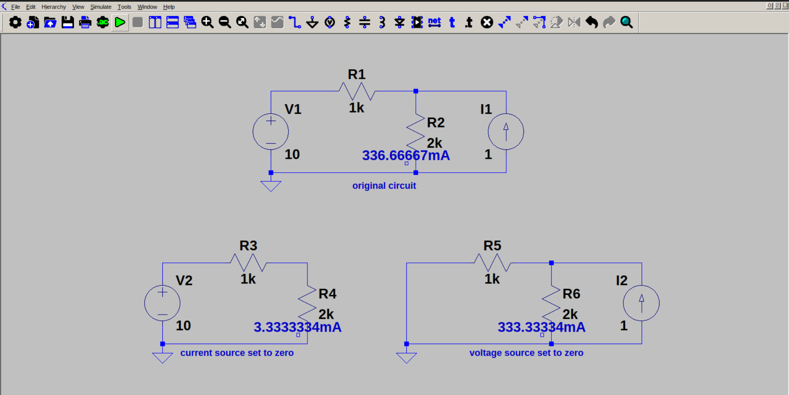

# Superposition theorem

Superposition theorem states that current through a branch is the sum of individual currents produced by each source, by setting other sources to zero.

The above circuit is the proof of superposition theorem.

Current through R2 is sum of current produced by the voltage source and current source. So first we set current source to zero (open circuit), and calculate current through the resistor. Then we set voltage source to zero (short circuit0, and calculate current through the resistor. We can see that the actual current through R2 is the exact sum of these currents.

This theorem is the base of Thevenin and Norton theorem.
