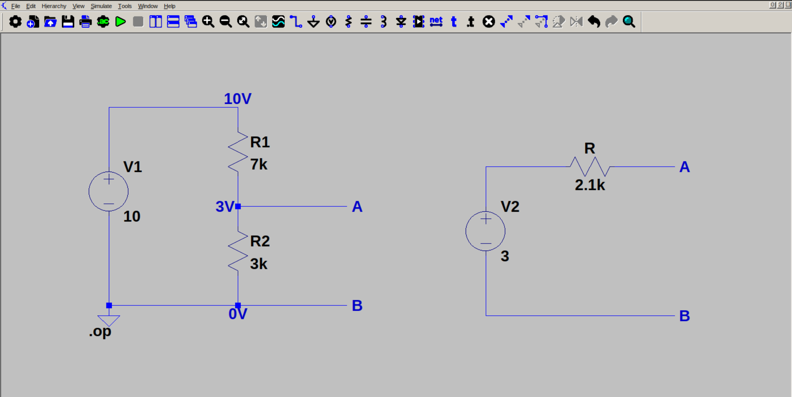

# Thevenin's theorem

Thevenin's theorem states that any two-terminal bidirectional linear network can be represented as a voltage source in series with a resistor. The voltage is called Thevenin voltage, and it is the open circuit voltage across the terminals. The resistance is called Thevenin resistance, and it is the effective resistance between the terminals when all sources are turned off.

In this example, we are finding the Thevenin equivalent circuit of a simple voltage divider. We are considering the terminals A and B.

$V_{thev} = V_{in}.R_2 / R_1 + R_2 = 3 V$

$R_{thev} = R1 || R2 = 2.1k$
