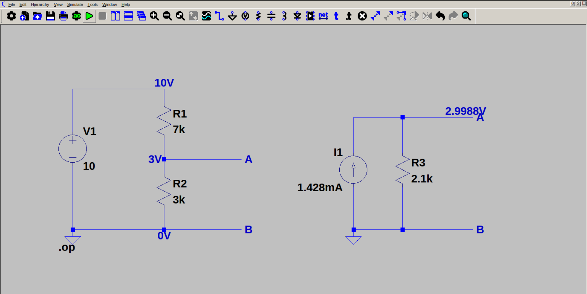

# Norton's theorem

Norton's theorem states that any two-terminal bidirectional linear network can be represented as current source in parallel with a resistor. The current is called Norton current, and it is the short circuit current through the terminals. The resistance is called Norton resistance, and it is the effective resistance between the terminals when all sources are turned off (same as Thevenin resistance).

In this example, we are finding the Norton equivalent circuit for a simple voltage divider between terminals A and B. 

Since $I_{norton}$ is the short circuit current through A & B, so the 3k resistor is neglected, and the effective resistance becomes just 7k. So, $I_{norton} = 1.428mA$.

$R_{norton} = R_{thev} = 2.1k$
