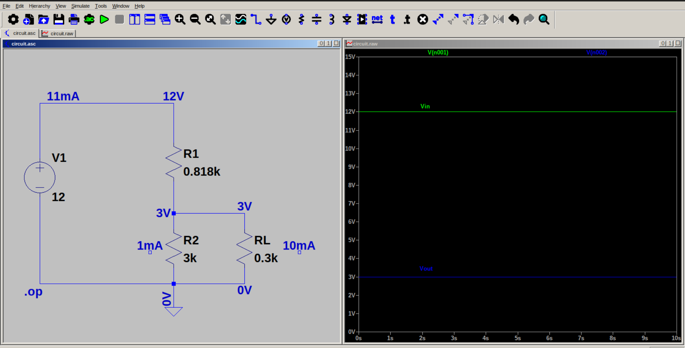

# Voltage Divider Circuit with load

A voltage divider circuit is the most basic circuit using resistors. It is used to step down a higher input voltage to a lower output voltage. 
Input voltage is applied across R1 and R2 in series, but output voltage is taken across R2 only.

The equation for output voltage when no load is attached is given by,

$$Vout = Vin.R2/R1+R2$$

However, when a load is attached, it can draw current from the circuit, causing the output voltage to change. This is called loading effect. To reduce loading effect, and get the desired output voltage, we use a rule of thumb called _10% rule_.

In this circuit, we are trying to build a voltage divider that steps down 12 V to 3 V. We have also connected a load, which draws 10 mA. So, by 10% rule, we will assume $I2 = 0.1I_{load}$. 

We can calculate R_{load} using Ohm's Law, and we get $R_{load} = 0.3k$. By 10% rule, $R2 = 10R_{load}$. 

While applying this rule, we call I2 and R2 as bleeding current and bleeding resistance. 

So, since we got I2 and I_{load}, total current = I2 + I_{load}. And then we can calculate R1 by Ohm's Law.

Because this is a rule of thumb, the current and voltage values will be approximate.

A benefit of applying this rule is, we can minimise power wastage through divider (only a small current passes through R2). 
